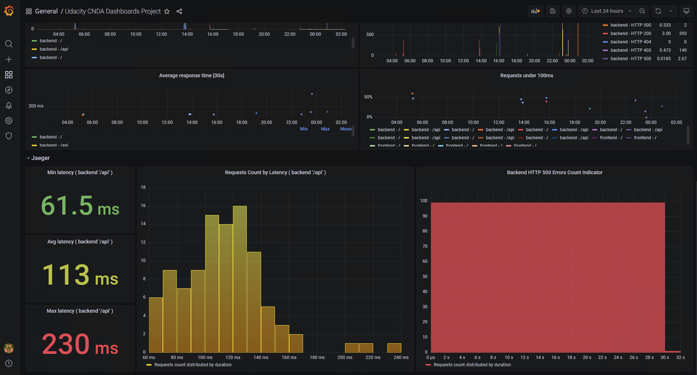
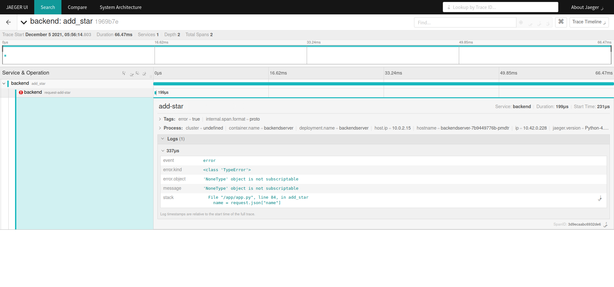

**Note:** For the screenshots, you can store all of your answer images in the `answer-img` directory.

## Verify the monitoring installation

*TODO:* run `kubectl` command to show the running pods and services for all components. Take a screenshot of the output and include it here to verify the installation

## Setup the Jaeger and Prometheus source
*TODO:* Expose Grafana to the internet and then setup Prometheus as a data source. Provide a screenshot of the home page after logging into Grafana.

## Create a Basic Dashboard
*TODO:* Create a dashboard in Grafana that shows Prometheus as a source. Take a screenshot and include it here.

## Describe SLO/SLI
*TODO:* Describe, in your own words, what the SLIs are, based on an SLO of *monthly uptime* and *request response time*.

`Montly Uptime`: This SLO could have a definition like have the site with a 99.95% or uptime for the frontend app, for that an SLI that could serve to measure that would be the ratio of failed and successful requests made to the frontend app, if the successes are in the 99.95 threshold we should be ok.

`Request Response Time`: For this SLO a valid objective would be to have a total response time for data to be rendered back into the frontend app of 300ms, this considering the API request time. One SLI that could help us to measure that is to have the average of the combined request time of backend and frontend calls by request and compare it with our goals, if the average is less than 300ms the apps work as expected

## Creating SLI metrics.
*TODO:* It is important to know why we want to measure certain metrics for our customer. Describe in detail 5 metrics to measure these SLIs.

`Uptime` The ratio the site or application is available to users, it's ussually represented by a percentage like 99% for example and is an important metric since a high available site won't have problems serving content to the users, a low uptime ratio, could make the site appear as unreliable or down, which could greatly impact the user experience.

`Errors` The ratio of requests with status code 40x or 50x over the total requests, it's also represented as a percentage, a high error ratio, could lead a user to believe the site is highly unreliable, but theses errors also could lead to data loss and security vulnerabilities since unhandled errors could expose exploits to external attackers.

`Latency` It's the time a request takes to retrieve data from ussually backend services or external services, is measured in milliseconds and this also have a great impact on the general user experience a site with high latency could also appear as unresponsive.

`Traffic` This is the data transfer volume of the site during a certain time based on the number of requests made, the measure is volume/time for example (Kilobytes or Megabytes) / Second, a high traffic volume on a short time could exhaust the available server resources like memory, cpu, and increase latency of other requests, as consequence this could impact user experience like explained above. 

`Saturation` This represents the exhaustion of server resources, like cpu, memory, storage, it's ussually measured as a percentage that represents the amount of any of those resources ocupied or free, high traffic could also have an impact on saturation but is not always the case, long and heavy processes could also deplete server resources, so it's important to monitor this metric as well, high saturation could impact the response time and increase latency. 

## Create a Dashboard to measure our SLIs
*TODO:* Create a dashboard to measure the uptime of the frontend and backend services We will also want to measure to measure 40x and 50x errors. Create a dashboard that show these values over a 24 hour period and take a screenshot.

## Tracing our Flask App
*TODO:*  We will create a Jaeger span to measure the processes on the backend. Once you fill in the span, provide a screenshot of it here. Also provide a (screenshot) sample Python file containing a trace and span code used to perform Jaeger traces on the backend service.

## Jaeger in Dashboards
*TODO:* Now that the trace is running, let's add the metric to our current Grafana dashboard. Once this is completed, provide a screenshot of it here.

## Report Error
*TODO:* Using the template below, write a trouble ticket for the developers, to explain the errors that you are seeing (400, 500, latency) and to let them know the file that is causing the issue also include a screenshot of the tracer span to demonstrate how we can use a tracer to locate errors easily.

TROUBLE TICKET

Name: Outage on the Backend Service

Date: 01/02/2022 12:00:00

Subject: Frequent HTTP 500 Errors detected

Affected Area: `/star` API-endpoint of the `backend` service

Severity: Critical

Description: There is a noticeable increase on the occurrence of 50x errors when there is a substancial number of requests against the `/star` endpoint of the backend service, it's critical to research this issue, since it's affecting the rating feature.

Trace:

## Creating SLIs and SLOs
*TODO:* We want to create an SLO guaranteeing that our application has a 99.95% uptime per month. Name four SLIs that you would use to measure the success of this SLO.

The following plan is created for the backend part:

`Traffic`:
* `SLI`: Number of requests each minute 
* `SLO`: It should handle 1800 requests per minute without perfomance degradation.

`Uptime`:
* `SLI`: Uptime of the backend per month measured on the request success ratio. 
* `SLO`: Uptime of the backend at 99.95%.

`Latency`:
* `SLI`: Average response time measured each 30 seconds on a month. 
* `SLO`: Average response time per request should be less than 100ms on a month measured each 30 seconds.
* `SLI`: Percentage of requests that finish on 100ms or less. 
* `SLO`: The percentage of requests that finish on 100ms or less should be 99%.

`Errors`:
* `SLI`: HTTP 500 errors % rate per 100 requests measured each minute. 
* `SLO`: HTTP 500 errors % rate should be less than 1% measured each minute.

## Building KPIs for our plan
*TODO*: Now that we have our SLIs and SLOs, create a list of 2-3 KPIs to accurately measure these metrics as well as a description of why those KPIs were chosen. We will make a dashboard for this, but first write them down here.

We should prepare the following kpi
* Uptime of the application availability per month (this is an embracing SLI indicating overall availability of our application).
* Average response time per 30 sec periods per month less than 100ms (this would indicate that the application smoothly serves the requests).
* HTTP 500 errors % rate per 1 minute ranges (small amount of errors is acceptable, and also a high number of errors HTTP 500 could indicate the presence of some bugs on the app).

## Final Dashboard
*TODO*: Create a Dashboard containing graphs that capture all the metrics of your KPIs and adequately representing your SLIs and SLOs. Include a screenshot of the dashboard here, and write a text description of what graphs are represented in the dashboard. 

Dashboard - Screenshots

KPIs

